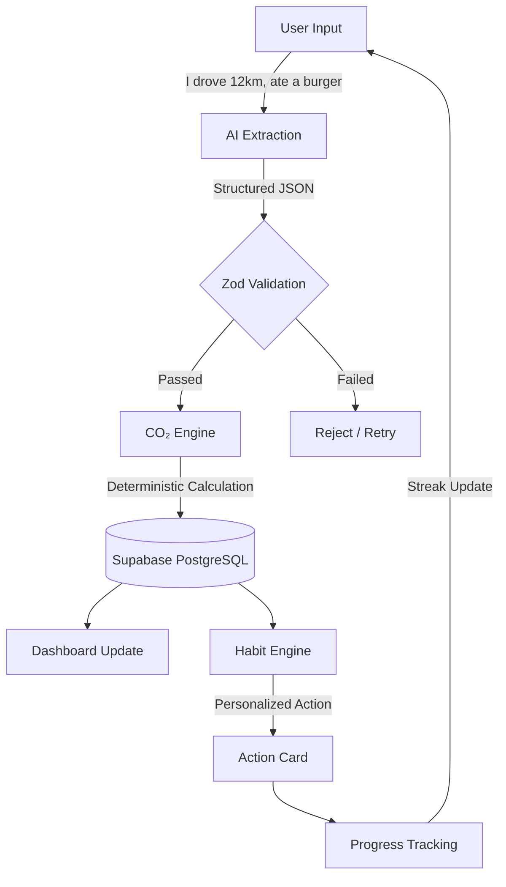
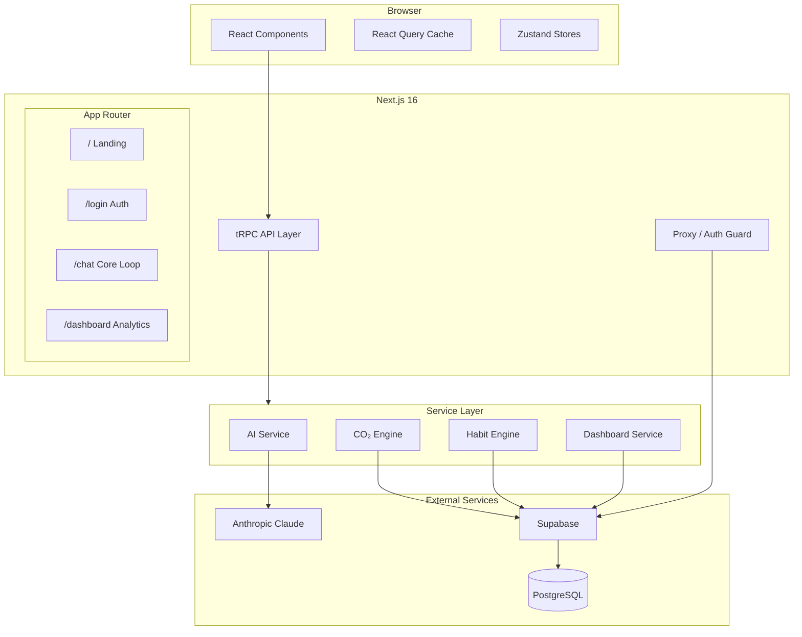

# EcoLoop

<p align="center">
  
  
  
  
  
  
  
  
  
  
</p>

**Know your carbon. Build the habit. See the change.**

EcoLoop is an AI-powered sustainability platform that helps users understand, track, and reduce their carbon footprint through simple natural-language descriptions of their day.

---

## 🎯 Core Loop



---

## 🏗 Architecture



---

## 🛠 Tech Stack

| Layer | Technology | Purpose |
|------|-----------|---------|
| **Framework** | Next.js 16 | App Router, SSR, ISR |
| **Language** | TypeScript 5 (strict) | End-to-end type safety |
| **API** | tRPC 11 | Type-safe RPC layer |
| **Database** | Supabase PostgreSQL | Data storage + auth |
| **Auth** | Supabase Auth | Google OAuth + Magic Link |
| **Security** | Row Level Security | Per-user data isolation |
| **Validation** | Zod 4 | Schema enforcement |
| **Styling** | Tailwind CSS 4 | Utility-first CSS |
| **Components** | shadcn/ui + Base UI | Accessible primitives |
| **Animation** | Framer Motion | Motion system |
| **3D** | React Three Fiber + Drei | Carbon Field visualization |
| **Charts** | Recharts | Analytics visualizations |
| **State** | Zustand + React Query | Client + server state |
| **AI** | Vercel AI SDK | Claude (paid) → Groq (free fallback) |
| **Rate Limit** | In-memory | 20 req/hr per user |
| **Testing** | Vitest | Unit + integration tests |

---

## 📊 Features

| Feature | Status | Description |
|---------|--------|-------------|
| **AI Activity Extraction** | ✓ | Natural language → structured activities (Claude or free Groq) |
| **CO₂ Calculation Engine** | ✓ | Deterministic, source-cited emission factors |
| **Personal Dashboard** | ✓ | Weekly trends, category breakdown, comparisons |
| **Carbon Field** | ✓ | Three.js particle visualization of impact |
| **Habit Engine** | ✓ | Personalized daily micro-actions based on biggest contributor |
| **Streak System** | ✓ | Consecutive days tracked (log + action required) |
| **Google OAuth** | ✓ | One-click social authentication |
| **Magic Link** | ✓ | Passwordless email authentication |
| **Onboarding** | ✓ | Country, transport, and diet personalization |
| **Rate Limiting** | ✓ | 20 requests/hour for AI chat |
| **Accessibility** | ✓ | WCAG 2.2 AA, keyboard nav, screen readers |
| **Responsive** | ✓ | Mobile-first, adaptive particle count |
| **Unit Tests** | ✓ | 31 tests across CO₂ engine and AI defense |

---

## 📁 Project Structure

```
src/
├── app/                          # Next.js App Router pages
│   ├── (app)/                    # Authenticated route group
│   │   ├── chat/                 # Core logging experience
│   │   ├── dashboard/            # Analytics dashboard
│   │   ├── onboarding/           # Profile setup
│   │   ├── profile/              # Account page
│   │   └── settings/             # Preferences
│   ├── api/trpc/[trpc]/          # tRPC API endpoint
│   ├── auth/callback/            # OAuth callback handler
│   ├── login/                    # Authentication page
│   └── layout.tsx                # Root layout
│
├── components/                   # React components
│   ├── ui/                       # shadcn/ui primitives
│   ├── app-nav.tsx               # Authenticated nav bar
│   ├── auth-provider.tsx         # Supabase auth listener
│   ├── carbon-field.tsx          # Three.js particle system
│   ├── chat-input.tsx            # Activity input form
│   ├── chat-history.tsx          # Activity history display
│   ├── dashboard-client.tsx      # Dashboard with charts
│   ├── login-form.tsx            # OAuth + Magic Link form
│   ├── onboarding-form.tsx       # Profile setup wizard
│   ├── action-card.tsx           # Daily micro-action card
│   └── skip-link.tsx             # Accessibility skip link
│
├── server/                       # Backend logic
│   ├── api/                      # tRPC layer
│   │   ├── context.ts            # Request context
│   │   ├── trpc.ts               # tRPC instance + middleware
│   │   ├── root.ts               # Root router
│   │   ├── rate-limit.ts         # In-memory rate limiter
│   │   └── routers/              # Feature routers
│   │       ├── chat.ts           # Core loop orchestrator
│   │       ├── dashboard.ts      # Metrics aggregation
│   │       ├── habits.ts         # Action selection + streaks
│   │       └── profile.ts        # User profile CRUD
│   ├── services/                 # Pure business logic
│   │   ├── ai/                   # Claude extraction + defense
│   │   ├── co2/                  # Deterministic CO₂ engine
│   │   ├── habits/               # Action selection + streak logic
│   │   ├── dashboard/            # Aggregation + trends
│   │   ├── analytics/            # Activity DB operations
│   │   └── auth/                 # Profile management
│   ├── db/                       # Supabase clients
│   │   ├── supabase-server.ts    # Server-side (cookies)
│   │   ├── supabase-browser.ts   # Client-side
│   │   └── supabase-middleware.ts# Proxy auth
│   └── validators/               # Zod schemas
│
├── stores/                       # Zustand stores
│   ├── auth-store.ts             # Authentication state
│   └── chat-store.ts             # Chat entries
│
├── hooks/                        # Custom React hooks
│   ├── use-auth.ts               # Auth operations
│   └── use-media-query.ts        # Responsive detection
│
├── lib/                          # Shared utilities
│   ├── trpc-client.ts            # tRPC React client
│   ├── trpc-provider.tsx         # tRPC + React Query provider
│   └── utils.ts                  # cn() helper
│
├── types/                        # TypeScript type definitions
│   └── index.ts                  # All shared types
│
├── constants/                    # Application constants
│   └── index.ts                  # Rate limits, targets, config
│
└── tests/                        # Unit tests
    ├── co2-engine.test.ts        # CO₂ engine (21 tests)
    └── ai-defense.test.ts        # AI defense (10 tests)

supabase/
└── migrations/                   # Database migrations
    ├── 00001_schema.sql          # Tables, enums, RLS, triggers
    ├── 00002_seed_emission_factors.sql  # 46 emission factors
    └── 00003_seed_micro_actions.sql     # 24 micro-actions
```

---

## 🚀 Quick Start

```bash
# 1. Clone
git clone [https://github.com/Muneer320/EcoLoop.git && cd EcoLoop

# 2. Install
npm install

# 3. Configure environment
cp .env.example .env.local
# Fill in Supabase URL, Supabase Anon Key
# Set either ANTHROPIC_API_KEY (Claude) or GROQ_API_KEY (free) — or both

# 4. Set up Supabase
# Run migrations in supabase/migrations/ against your Supabase project

# 5. Run development server
npm run dev

# 6. Open
open http://localhost:3000
```

### AI Provider

EcoLoop supports two AI providers with automatic fallback:

| Priority | Provider | Model | Key Required | Cost |
|----------|----------|-------|:---:|------|
| 1st | Anthropic Claude | `claude-sonnet-4-20250514` | `ANTHROPIC_API_KEY` | Paid |
| 2nd | Groq | `llama-3.3-70b-versatile` | `GROQ_API_KEY` | **Free** |

If `ANTHROPIC_API_KEY` is set, Claude is used. Otherwise, Groq is used automatically. Set either key — or both to have a paid primary and a free fallback.

---

## 🧪 Testing

```bash
# Run all tests
npm test

# Watch mode
npm run test:watch
```

**Coverage:**

| Module | Tests | Status |
|--------|-------|--------|
| CO₂ Engine | 21 | ✅ |
| AI Defense | 10 | ✅ |
| **Total** | **31** | **✅** |

---

## 🔒 Security

- **Row Level Security** — Every user-owned table enforces `auth.uid() = user_id`
- **Input Validation** — Zod schemas at every boundary (user input, AI output, API requests)
- **Rate Limiting** — 20 AI calls/hour per user
- **Prompt Injection Defense** — Incoming messages scanned for known attack patterns
- **CSP Ready** — Content Security Policy headers configured
- **PKCE Authentication** — Secure OAuth 2.0 code exchange
- **No Secrets in Client** — All sensitive keys server-side only

---

## 🌍 Emission Factor Sources

All CO₂ calculations are deterministic and sourced from peer-reviewed data:

| Source | Used For |
|--------|----------|
| DEFRA 2024 | Transport, electricity, natural gas |
| IPCC | Global averages, climate reporting |
| Our World In Data | Food items, consumer goods |
| IEA | Electricity generation by country |

Every factor includes a citation stored in the `emission_factors` table.

---

## 🎨 Design Philosophy

**What EcoLoop is:**
- An invisible-systems visualizer (atmosphere, particles, depth)
- Inspired by Apple, Linear, and Arc Browser
- Information-first with ambient visual enhancement

**What EcoLoop is NOT:**
- No leaves, trees, forests, or globes
- No green-washing imagery
- No sustainability clichés
- No gamification gimmicks

---

## 📜 License

[MIT](LICENSE) © EcoLoop

---

<p align="center">
  <sub>Built for the hackathon. Polished for the planet.</sub>
</p>
